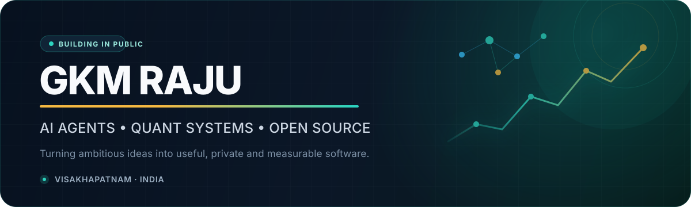

<div align="center">
  
</div>

<div align="center">
  <a href="https://github.com/gkmraju?tab=followers"></a>
  <a href="mailto:rajujumpsforu@gmail.com"></a>
  
</div>

<br />

## Hello — I build systems that find signal in noise.

I am **GKM Raju**, a builder and lifelong learner from Visakhapatnam, India. My work sits where **AI agents, financial markets, developer tooling, and useful automation** meet.

I like software that is private by design, measurable in practice, and capable of doing real work—not just producing impressive demos.

```text
CURRENT SIGNAL  →  AI agents · RAG · MCP · multi-agent orchestration · observability · quant research
BUILDING STYLE  →  Local-first when possible · automation-first · evidence over hype
OPEN TO         →  Open-source collaboration · ambitious products · meaningful contributions
```

## Selected work

<table>
  <tr>
    <td width="50%" valign="top">
      <h3><a href="https://github.com/gkmraju/PennyRush">💸 PennyRush</a></h3>
      <p>Privacy-first personal finance for Android and web. Imports statements and scans receipts without keeping the raw files.</p>
      <a href="https://github.com/gkmraju/PennyRush"></a>
      <a href="https://github.com/gkmraju/PennyRush"></a>
    </td>
    <td width="50%" valign="top">
      <h3><a href="https://github.com/gkmraju/Intelligent-Recruiter">🧠 Intelligent Recruiter</a></h3>
      <p>CPU-only candidate discovery that ranks 100K profiles with hybrid retrieval and fact-grounded recommendations.</p>
      <a href="https://github.com/gkmraju/Intelligent-Recruiter"></a>
      <a href="https://github.com/gkmraju/Intelligent-Recruiter"></a>
    </td>
  </tr>
  <tr>
    <td width="50%" valign="top">
      <h3><a href="https://github.com/gkmraju/AI-Usage-Analytics">📊 AI Usage Analytics</a></h3>
      <p>Local-first analytics for AI coding assistants: estimated tokens, costs, quotas, sessions, and project activity.</p>
      <a href="https://github.com/gkmraju/AI-Usage-Analytics"></a>
      <a href="https://github.com/gkmraju/AI-Usage-Analytics"></a>
    </td>
    <td width="50%" valign="top">
      <h3><a href="https://github.com/gkmraju/Bounty-Radar">🎯 Bounty Radar</a></h3>
      <p>Normalizes, scores, stores, and publishes the strongest OSS and responsible-disclosure bounty opportunities.</p>
      <a href="https://github.com/gkmraju/Bounty-Radar"></a>
      <a href="https://github.com/gkmraju/Bounty-Radar"></a>
    </td>
  </tr>
  <tr>
    <td width="50%" valign="top">
      <h3><a href="https://github.com/gkmraju/quant-github-scout">📡 Quant GitHub Scout</a></h3>
      <p>Finds and ranks fresh repositories across quant research, algo trading, crypto, backtesting, and Indian options.</p>
      <a href="https://github.com/gkmraju/quant-github-scout"></a>
      <a href="https://github.com/gkmraju/quant-github-scout"></a>
    </td>
    <td width="50%" valign="top">
      <h3><a href="https://github.com/gkmraju/GitHub-Contribution-Agent">🌱 Contribution Agent</a></h3>
      <p>A responsible workflow for discovering and completing small, useful open-source contributions every day.</p>
      <a href="https://github.com/gkmraju/GitHub-Contribution-Agent"></a>
      <a href="https://github.com/gkmraju/GitHub-Contribution-Agent"></a>
    </td>
  </tr>
</table>

## The builder's toolbox

<div align="center">
  
</div>

<br />

| Domain | What I explore and build |
|:--|:--|
| **Agentic AI** | MCP, RAG, tool-using agents, multi-agent orchestration, evaluation and observability |
| **Quant systems** | Market structure, GEX, systematic research, backtesting and trading automation |
| **Developer tools** | Local-first analytics, workflow automation, discovery engines and practical AI utilities |
| **Open source** | Evidence-led contributions, responsible automation and useful documentation |

## GitHub pulse

<!-- GITHUB-PULSE:START -->
| 🟢 Current status | 📦 Public repositories | 🔀 Authored PRs · 365d | ✅ Merged PRs |
|:--:|:--:|:--:|:--:|
| **Active today** | **22** | **25** | **10** |

| 🎯 Primary focus | 🌍 External PRs · 365d | 🛠 Owned-project PRs · 365d | 📍 Based in |
|:--:|:--:|:--:|:--:|
| **AI agents + Quant** | **3** | **22** | **Visakhapatnam, India** |

### Recent public work

| Work | Repository | Link |
|:--|:--|:--:|
| Reliable repository-native GitHub Pulse | `gkmraju/gkmraju` | [PR #3](https://github.com/gkmraju/gkmraju/pull/3) |
| Premium AI + quant profile redesign | `gkmraju/gkmraju` | [PR #2](https://github.com/gkmraju/gkmraju/pull/2) |
| Persisted Tailnet configuration guidance | `paperclipai/paperclip` | [PR #12213](https://github.com/paperclipai/paperclip/pull/12213) |
| Bounded PDG guard-query documentation | `abhigyanpatwari/GitNexus` | [PR #3042](https://github.com/abhigyanpatwari/GitNexus/pull/3042) |
| Deterministic bounty ranking tests | `gkmraju/Bounty-Radar` | [PR #16](https://github.com/gkmraju/Bounty-Radar/pull/16) |

<sub>Verified snapshot · 26 August 2026. Daily automation may replace this block with newer GitHub-native figures; this complete snapshot remains the fallback.</sub>
<!-- GITHUB-PULSE:END -->

## Build with me

If you are working on **AI infrastructure, quant research, private-by-design products, or developer productivity**, I would enjoy comparing notes—or building something genuinely useful together.

<div align="center">
  <a href="mailto:rajujumpsforu@gmail.com"></a>
</div>

<br />

<div align="center">
  <sub><strong>Signal over noise. Systems over shortcuts. Impact over activity.</strong></sub>
</div>
